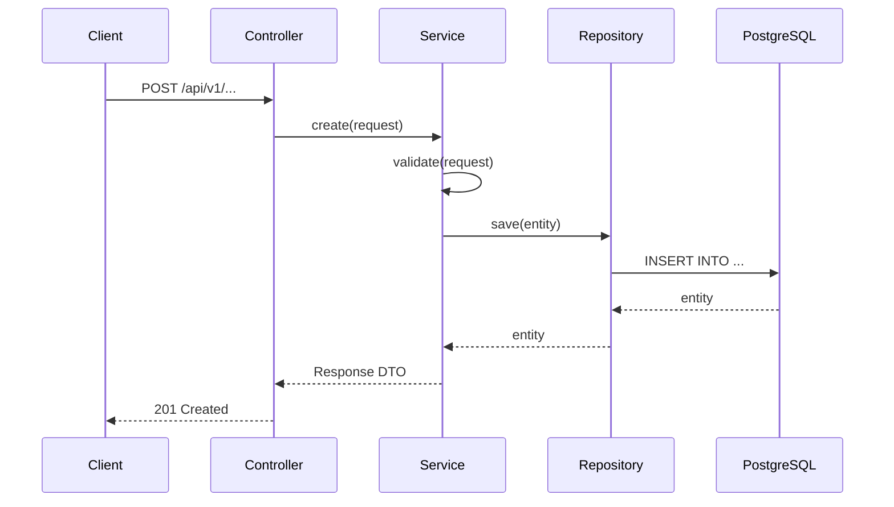
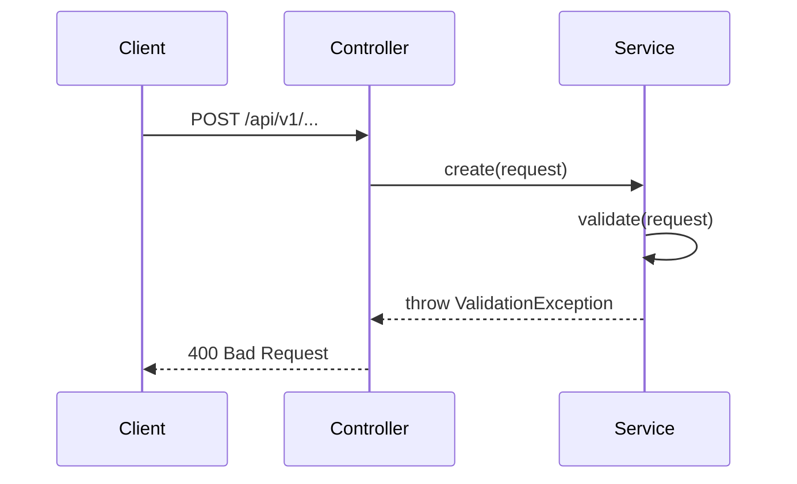

# 03 — Solution Doc (bản đầy đủ)

> Dùng cho task **≥ 5 điểm** hoặc **chạm DB / API contract chung**.
> Task ≤ 3 điểm, không chạm DB → dùng [04-solution-doc-lite.md](04-solution-doc-lite.md).

## Template

```markdown
# {PREFIX}-{SEQ} — {Tên task}

**Task:** {PLANE_BASE_URL}/{WORKSPACE}/projects/{PROJECT_ID}/issues/{ISSUE_ID}
**Người viết:** {Tên dev}
**Ngày:** {YYYY-MM-DD}

## 1. Acceptance Criteria

<!-- Copy NGUYÊN KHỐI ✅ AC từ task Plane vào đây.
     Bot AI trên GitHub KHÔNG đọc được Plane — dán AC ở đây để bot đối chiếu.
     Mục này trống/thiếu → AI sẽ báo [must]. -->

- [ ] AC1: ...
- [ ] AC2: ...
- [ ] AC3: ...

## 2. Bối cảnh & Vấn đề

<!-- Tóm tắt: tại sao cần làm task này? Vấn đề gì đang xảy ra? -->

## 3. Giải pháp (Approach)

### 3.1 Phương án đề xuất

<!-- Mô tả giải pháp chọn, 5–15 dòng. Trả lời: làm gì, ở đâu, tại sao chọn cách này. -->

### 3.2 So sánh phương án (nếu có ≥ 2 cách)

| Tiêu chí | Phương án A | Phương án B |
|----------|-------------|-------------|
| Mô tả | ... | ... |
| Ưu điểm | ... | ... |
| Nhược điểm | ... | ... |
| Effort | ... | ... |
| **Chọn** | ✅ / ❌ | ✅ / ❌ |

## 4. Sequence Diagram

<!-- Vẽ bằng Mermaid. Mô tả luồng chính (happy path) và ít nhất 1 luồng lỗi. -->

### 4.1 Happy path



### 4.2 Luồng lỗi



## 5. Database Changes

### 5.1 Schema changes

<!-- Flyway migration file. Đặt tên: V{version}__{description}.sql -->

```sql
-- V{NEXT_VERSION}__{description}.sql

CREATE TABLE IF NOT EXISTS table_name (
    id              UUID PRIMARY KEY DEFAULT gen_random_uuid(),
    -- columns
    created_at      TIMESTAMP WITH TIME ZONE NOT NULL DEFAULT NOW(),
    updated_at      TIMESTAMP WITH TIME ZONE NOT NULL DEFAULT NOW(),
    is_deleted      BOOLEAN NOT NULL DEFAULT FALSE
);

CREATE INDEX idx_table_name_column ON table_name(column);
```

### 5.2 Impact lên data hiện có

<!-- Có cần migrate data cũ không? Query hiện có bị ảnh hưởng không? -->

- Migration có backward-compatible không: CÓ / KHÔNG
- Cần migrate data cũ: CÓ / KHÔNG
- Query hiện có bị ảnh hưởng: liệt kê

## 6. API Contract

### 6.1 Input

**Endpoint:** `POST /api/v1/...`

**Headers:**
```
Authorization: Bearer {token}
Content-Type: application/json
```

**Request Body:**
```json
{
  "field1": "string (required, max 255)",
  "field2": "UUID (required)",
  "field3": "string (optional)"
}
```

**Validation Rules:**
| Field | Rule | Error |
|-------|------|-------|
| field1 | required, max 255 chars | 400 "field1 is required" |
| field2 | required, valid UUID | 400 "field2 must be valid UUID" |

### 6.2 Output

**Success (201 Created):**
```json
{
  "success": true,
  "data": {
    "id": "uuid",
    "field1": "string",
    "createdAt": "2024-01-01T00:00:00Z"
  },
  "error": null
}
```

**Error (400 Bad Request):**
```json
{
  "success": false,
  "data": null,
  "error": "Validation failed: field1 is required"
}
```

**Error (403 Forbidden):**
```json
{
  "success": false,
  "data": null,
  "error": "Insufficient permissions"
}
```

## 7. Đụng vào đâu

| Loại | File/Module |
|------|-------------|
| Entity mới | `entity/TableName.java` |
| DTO mới | `dto/CreateTableNameRequest.java`, `dto/TableNameResponse.java` |
| Repository | `repository/TableNameRepository.java` |
| Service | `service/TableNameService.java`, `service/impl/TableNameServiceImpl.java` |
| Controller | `controller/TableNameController.java` |
| Migration | `resources/migration/V{version}__{description}.sql` |
| Redis (nếu có) | `redis/entity/TableNameRedis.java`, `redis/repository/TableNameRedisRepository.java` |
| Chạm DB/API contract chung? | CÓ — đây là lý do dùng template full |

## 8. Đánh giá rủi ro & Impact

| Rủi ro | Mức độ | Giảm thiểu |
|--------|--------|-----------|
| Migration fail trên production | High | Test trên staging trước |
| Breaking API change | Medium | Versioning API, deprecation period |
| Performance regression | Low | Load test trước merge |

## 9. Test Plan

### Unit test
- [ ] Service: happy path
- [ ] Service: validation failure
- [ ] Service: permission denied
- [ ] Service: entity not found

### Integration test
- [ ] API endpoint: full request-response cycle
- [ ] Database: migration runs clean from scratch

### Test tay
- [ ] Gọi API bằng Postman/curl, verify response
- [ ] Check DB sau khi gọi API
```

## Quy trình duyệt

1. Dev viết solution doc → commit + push → mở **PR CHỈ chứa doc**
   - Tiêu đề: `docs(solution): {PREFIX}-{SEQ} {mô tả ngắn}`
2. AI review tầng 1 chạy tự động → dev sửa theo `[must]`
3. Sub-lead review → Approve + **Merge (squash)**
   - ⚠️ **KHÔNG bấm delete branch** — dev tiếp tục code trên branch này
4. Dev: `git pull --no-rebase origin develop` — bắt buộc, đồng bộ sau squash
5. **Chỉ sau khi doc được merge** → dev mới bắt đầu code
